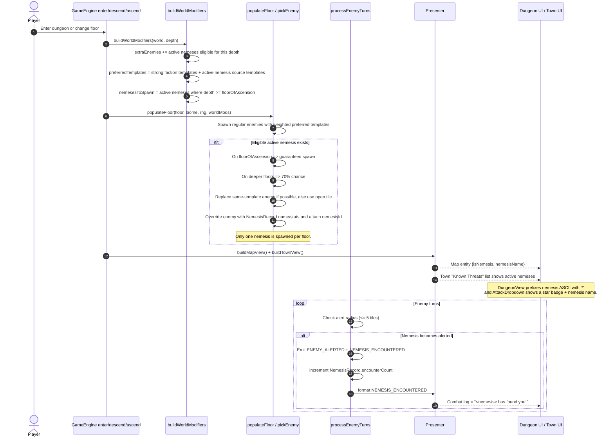
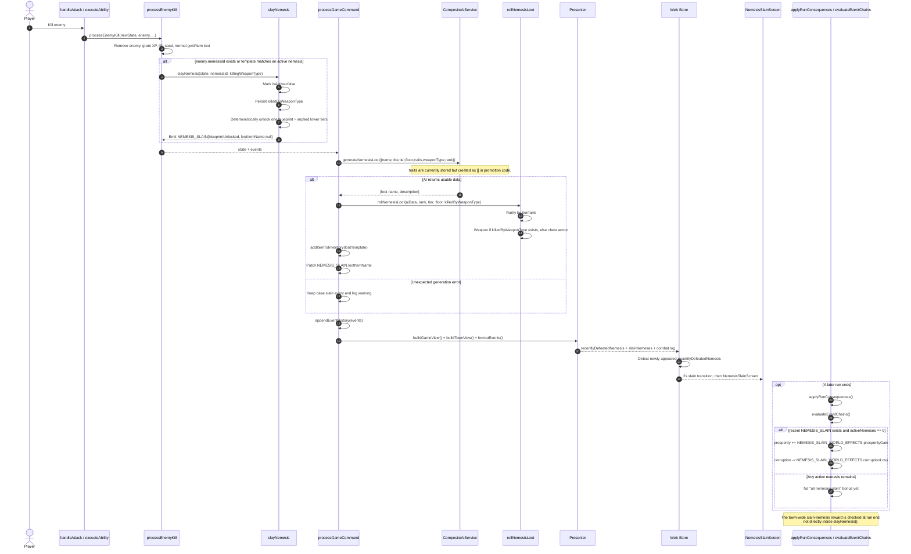
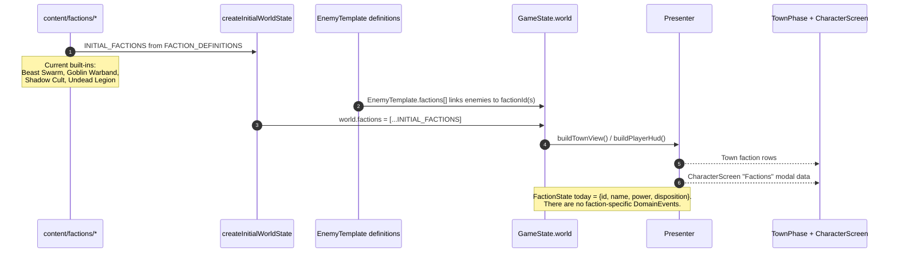
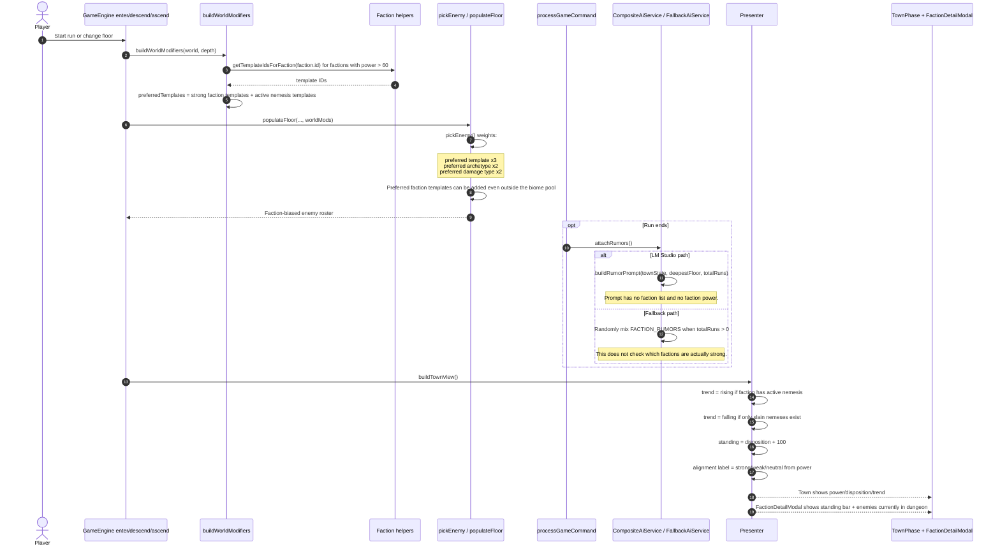

# Nemesis and Faction Sequence Diagrams

These Mermaid sequence diagrams reflect the current code paths for the nemesis and faction systems. They are intentionally implementation-focused: engine, server, presenter, UI, rewards, and the main "works today" limitations are all included.

---

## Nemesis System

### 1. Promotion on player death and naming

```mermaid
sequenceDiagram
    autonumber
    actor Player
    participant Web as Web App / Store
    participant API as Server API
    participant Cmd as processGameCommand
    participant Engine as GameEngine.submitCommand
    participant Death as death.ts
    participant Nem as nemesis.ts
    participant AI as CompositeAiService
    participant Present as Presenter
    participant UI as App + NemesisRisenScreen

    Player->>Web: Send command
    Web->>API: POST /api/games/:id/commands
    API->>Cmd: processGameCommand()
    Cmd->>Engine: submitCommand(state, command)

    Note over Engine,Death: During enemy turns or status resolution, player HP reaches 0
    Engine->>Death: handlePlayerDeath(...)

    Death->>Death: Emit PLAYER_DIED
    Death->>Death: Emit RUN_ENDED(reason=death) + PHASE_CHANGED(to=town)
    opt Equipped items exist
        Death->>Death: Emit EQUIPMENT_DROPPED
    end

    alt Killer enemy exists and shouldPromoteToNemesis() passes
        Death->>Nem: promoteToNemesis(state, killer, floor, rng)
        Nem->>Nem: Rank = prior records of same template + 1 (cap 3)
        Nem->>Nem: Boost stats by rank multiplier + floor-based min HP
        Nem->>Nem: If prior same-template nemesis was slain by same weapon type, add +3 DEF
        Nem->>Nem: Create NemesisRecord{traits:[], weaknesses:[], encounterCount:0, killCount:1, isActive:true}
        Nem-->>Death: state + NEMESIS_PROMOTED(fallback name/title)
    else Trap/status death, permadeath, low floor, cap reached, or RNG fail
        Death-->>Engine: No nemesis promotion
    end

    Engine->>Engine: applyRunConsequences() because runEnded=true
    Engine-->>Cmd: result.state + events

    opt NEMESIS_PROMOTED exists
        Cmd->>AI: generateNemesisName({sourceTemplateId, tier, floor, biome})
        alt LM Studio returns valid JSON
            AI-->>Cmd: {name, title}
        else Parse/LM failure
            AI-->>Cmd: fallback random {name, title}
        end
        Cmd->>Cmd: Update state.world.nemeses[name,title]
        Note over Cmd,Present: The NEMESIS_PROMOTED event itself is not rewritten.<br/>Combat log text can still use the pre-AI fallback name.
    end

    Cmd->>Cmd: appendEventHistory(events)
    Cmd->>Present: buildGameView() + formatEvents()
    Present-->>Web: GameView{town.nemeses, deathContext, combatLog}
    Web->>UI: Show NemesisRisenScreen when town.runSummaryStats.nemesisPromoted=true

    Note over UI: App first tries to parse the risen name from combat log;<br/>if it no longer matches renamed state, it falls back to the last active nemesis.
```

### 2. Return spawning, encounter, and player-visible presence



### 3. Defeat, rewards, loot generation, and downstream town effects



### Nemesis notes for current behavior

- Nemesis creation only happens on enemy-caused player death. Trap, status, and permadeath paths do not create a nemesis.
- Nemesis names are generated twice conceptually: a fallback name/title inside `promoteToNemesis()`, then an optional server-side AI rename. The event/combat log keeps the original promoted-event name.
- `traits` and `weaknesses` exist in types and UI, but promotion currently initializes both as empty arrays.
- `killCount` is initialized and displayed, but the current code does not increment it after creation.

---

## Faction System

### 1. Initialization and data model



### 2. Power and disposition mutation loop

```mermaid
sequenceDiagram
    autonumber
    actor Player
    participant Combat as processEnemyKill
    participant FSys as factions.ts
    participant Content as getPrimaryFactionId
    participant Engine as GameEngine
    participant World as applyRunConsequences
    participant Present as Presenter
    participant UI as Town + Faction modal

    Player->>Combat: Kill an enemy
    Combat->>FSys: updateFactionOnKill(state, enemy.templateId)
    FSys->>Content: getPrimaryFactionId(templateId)

    alt Enemy template has a primary faction
        Content-->>FSys: factionId
        FSys->>FSys: power = max(0, power - 3)
        Note over FSys: State mutates silently; no event is emitted.
    else No faction on template
        FSys-->>Combat: State unchanged
    end

    opt Run later ends
        Engine->>World: applyRunConsequences(state, runMetrics)
        World->>FSys: tickFactionPowerForNemeses(state)
        alt Active nemesis exists
            FSys->>FSys: For each unique active nemesis source faction,<br/>power = min(100, power + 5)
        end

        World->>World: evaluateEventChains()
        alt faction.power == 0 and disposition < -10
            World->>World: disposition = min(-10, disposition + 20)
            Note over World: "broken/scattered" factions soften toward the player.
        end
    end

    World->>Present: buildTownView() + buildPlayerHud()
    Present-->>UI: Updated power/disposition/standing
```

### 3. Spawn bias, rumors, and current presentation rules



### Faction notes for current behavior

- Factions are currently a relatively thin system: mostly `power`, `disposition`, spawn bias, rumors, and UI readouts.
- Faction mutations are silent state changes today. There are no faction-specific domain events.
- Kill-based faction updates use the enemy template's primary faction only.
- Faction trend in town is nemesis-driven, not power-delta-driven.
- The CharacterScreen faction modal labels "Disposition" using a power-derived strong/weak/neutral string, while the standing bar uses `disposition + 100`.
- Fallback faction rumors are only loosely connected to actual world state; they do not check which factions are currently strongest.
